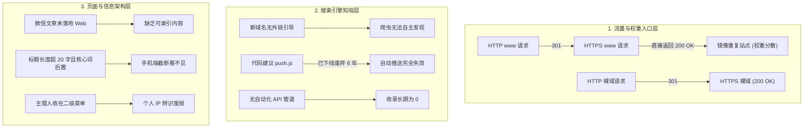
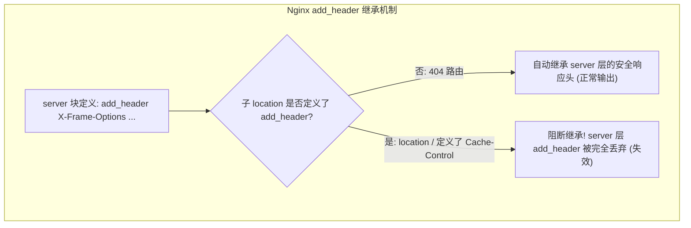

# 《智能实战笔记》全站 SEO 优化、域名规范化与架构合规重构深度复盘

> **项目名称**：智能实战笔记（原江西 AI 圈）  
> **生产域名**：`https://jiangxiai.top/`  
> **主机环境**：百度云 Ubuntu 22.04 LTS / Nginx 1.24.0  
> **备案信息**：赣ICP备2026022141号-1（个人博客性质） / 赣公网安备36012202000676号  
> **主理人 IP**：莫西  
> **复盘时间**：2026-09-26  

---

## 一、 项目背景与关键约束边界

### 1.1 项目初始状态
本站原定位为江西本土 AI 生态与一人公司（OPC）技术交流站，技术底座扎实，静态页面性能良好（LCP/FCP 表现优异）。然而在 2026 年 9 月开展的专业 SEO 审计中，暴露了核心指标断崖式问题：
- **百度搜索引擎收录为 0**（`site:jiangxiai.top` 无任何结果）；
- **HTTPS 下的 `www` 与裸域同时返回 200 OK**，形成内容镜像，导致权威度与权重分散；
- **大量本地实战纪实流于微信公众号外链**，未沉淀为独立 Web 静态页面，沦为 SEO 内容孤岛；
- **页面存在历史过期活动与收费课程卡片**（如“68元夜校”等），严重偏离个人博客属性。

### 1.2 不可逾越的合规红线（ICP 个人备案）
本站必须在以下三条**绝对红线**内进行重构：
1. **ICP 备案合规红线**：根据《互联网信息服务管理办法》及工信部/江西省通信管理局要求，个人性质备案网站（名称备案为**「智能实战笔记」**）**严禁**使用“官方”、“社区”、“平台”、“联盟”、“夜校”、“招生”、“合伙人招募”等具有组织化、经营性、商业化色彩的字眼。
2. **核心品牌 IP 锚定**：既要满足备案名称“智能实战笔记”的字面要求，又要强力沉淀并突出主理人“莫西”的个人研发实战 IP，以及“江西OPC”、“赣州AI”等地域业务搜索词。
3. **第三方报道与自研笔记边界**：新闻单位（江西日报、科技日报、澎湃等）的报道受《互联网新闻信息服务管理规定》约束，个人博客无新闻资质，绝不可在本地“伪原创或全文转载”建立独立页面，仅可作为引用外链；而莫西本人或本地各站点原创的实战手记、探访纪实，则必须独立静态化并被搜索引擎收录。

---

## 二、 核心问题深度剖析与根因定位



### 2.1 域名与网络层：Nginx 逻辑缺陷导致 200 镜像与权重分散
在原部署脚本 `deploy/deploy-https.sh` 中，写入 `/etc/nginx/conf.d/jiangxiai.top.conf` 的逻辑存在严重失误：
1. **80 端口使用动态变量**：`return 301 https://$host$request_uri;`。当用户或爬虫请求 `http://www.jiangxiai.top` 时，`$host` 保持为 `www.jiangxiai.top`，导致其被重定向到带 `www` 的 HTTPS，而非规范主域名；
2. **443 端口混域名监听**：配置为 `server_name jiangxiai.top www.jiangxiai.top;`。在同一个 server 块中响应两个域名，直接导致 `https://www.jiangxiai.top` 返回 `HTTP/2 200 OK`，两个完全一样的站点同时存在，引发搜索引擎判定为“重复镜像”，链接权重一分为二。

### 2.2 搜索引擎层：百度收录为 0 的真相与推送真空
审计报告最初建议注入 `zz.bdstatic.com/linksubmit/push.js`（JS 自动推送），经深度技术核验确认：**百度早在 2020 年因安全攻击和滥用彻底下线了 push.js 服务**，该脚本请求会直接 404 或超时。
同时：
- 新域名上线仅 7 个月，且经历过改版，外界几乎零自然外链；
- 蜘蛛无法通过网页链接链条自然发现站点；
- 未曾对接百度搜索资源平台 API，导致收录一直处于真空状态。

### 2.3 合规风控层：更新日志（Changelog）的“欲盖弥彰”
原 `changelog.html` 记录了真实的演进历史，但包含了大量触犯个人备案红线的描述：
- 如“官方合作伙伴”、“合伙人招募”、“转化路径”、“补贴金额与虚构项目”；
- 甚至在本次优化初期写道“下架南昌 AI 夜校及历史过期报名卡片以遵循合规”。
如果管局巡检员或安全网检系统扫描该页面，会直接判定“该站此前存在未经审批的商业/教育培训业务，现试图规避监管”，存在被责令整改甚至注销备案的巨大隐患。

### 2.4 工程与发布流水线层：打包命令与权限陷阱
原工程虽然设计了 `deploy-https.sh` 与 `package-baidu.sh`，但在配合自动化工具时存在隐形断层：
- **路径前缀污染**：使用 `tar -C site-release .` 打包时，会把 `./` 作为根目录打入包内。解压时不仅修改目标文件夹自身属性，且原脚本中的 Python 安全解析器会直接报错 `Unsafe archive member: ./` 退出；
- **用户组权限混淆**：混淆了宝塔/CentOS 的 `www:www` 与原生 Ubuntu 的 `www-data:www-data`，若执行错误用户组赋权会导致 Nginx 进程无法读取静态资源报 403；
- **配置覆盖覆盖死循环**：`deploy-https.sh` 硬编码了重写 Nginx 的逻辑，每次部署解压网站包后，会把旧的、有 Bug 的 Nginx 配置再次覆盖回去。

---

## 三、 全链路技术解决方案与落地成果

### 3.1 Nginx 301 域名规范化重构（彻底收敛权威度）

针对 Nginx 缺陷，我们设计并落地了标准、解耦的 3 块架构：

```nginx
# ==============================================================================
# 1. 80 端口：无论是裸域还是 www，全部强制 301 归一跳转至主域名 https://jiangxiai.top
# ==============================================================================
server {
    listen 80;
    listen [::]:80;
    server_name jiangxiai.top www.jiangxiai.top;

    location /.well-known/acme-challenge/ {
        root /www/wwwroot/jiangxiai.top;
        try_files $uri =404;
    }

    location / {
        return 301 https://jiangxiai.top$request_uri;
    }
}

# ==============================================================================
# 2. 443 端口：www.jiangxiai.top 独立 server 块，统一 301 重定向至主域名
# ==============================================================================
server {
    listen 443 ssl http2;
    listen [::]:443 ssl http2;
    server_name www.jiangxiai.top;

    # 复用已有的 DigiCert DV SAN 多域名证书
    ssl_certificate     /etc/nginx/ssl/jiangxiai.top/www.jiangxiai.top.pem;
    ssl_certificate_key /etc/nginx/ssl/jiangxiai.top/www.jiangxiai.top.key;

    return 301 https://jiangxiai.top$request_uri;
}

# ==============================================================================
# 3. 443 端口：主站专用 server 块（唯一提供 200 OK 的官方页面）
# ==============================================================================
server {
    listen 443 ssl http2;
    listen [::]:443 ssl http2;
    server_name jiangxiai.top;

    root /www/wwwroot/jiangxiai.top;
    index index.html;

    ssl_certificate     /etc/nginx/ssl/jiangxiai.top/www.jiangxiai.top.pem;
    ssl_certificate_key /etc/nginx/ssl/jiangxiai.top/www.jiangxiai.top.key;
    # ... gzip, 缓存策略, 安全响应头保持原样 ...
}
```

为了确保无痛热更新，开发了自动化修复脚本 [`fix-nginx-redirect.sh`](file:///Users/hugo0129/breakout/01_业务/项目/vibe/gemini3/fix-nginx-redirect.sh)：
- 自动提取原配置中 SSL 证书与私钥路径；
- 采用 Python 精准重构语法，避免 `sed` 转义丢失 `$request_uri`；
- 执行 `nginx -t` 语法自检，通过才执行 `nginx -s reload`，失败自动毫秒级回滚。

---

### 3.2 百度 API 自动化提交管道闭环

既然前端 JS 自动推送已废弃，唯一权威、稳定且获官方推荐的方案是：**服务端 API 主动推送 + Sitemap 定时抓取**。

1. **打通服务端 API 推送管道**：
   在服务器 `/root/push-baidu.sh` 部署自动化推送脚本，使用站点 API Token（`sH7HsblPIlcATYI6`），动态从最新的 `/www/wwwroot/jiangxiai.top/sitemap.xml` 中使用正则提取全部 `<loc>` 链接，一次性批量推送到百度收录接口：
   ```bash
   #!/usr/bin/env bash
   SITEMAP="/www/wwwroot/jiangxiai.top/sitemap.xml"
   URL_LIST="/tmp/baidu_urls.txt"
   grep -oPm1 "(?<=<loc>)[^<]+" "$SITEMAP" > "$URL_LIST"
   curl -H "Content-Type:text/plain" --data-binary @"$URL_LIST" \
     "http://data.zz.baidu.com/urls?site=https://jiangxiai.top&token=sH7HsblPIlcATYI6"
   ```
2. **注册 Crontab 定时任务**：
   配置 `30 4 * * * /root/push-baidu.sh >> /var/log/push-baidu.log 2>&1`，实现每天凌晨 04:30 自动向百度全量同步站点更新。

---

### 3.3 品牌与 SEO 元数据规范落地

全站所有 15 个页面严格执行统一的 SEO Title 公式：
$$\text{SEO Title} = \text{[核心内容]} + \text{ ｜ 莫西 · 智能实战笔记}$$

| 页面文件 | 优化后 Title (严格 ≤ 20 汉字) | 承载的核心搜索词 |
| :--- | :--- | :--- |
| `index.html` | 江西AI与一人公司实践 ｜ 莫西 · 智能实战笔记 | 江西AI、一人公司、实战笔记 |
| `opc.html` | 江西一人公司(OPC)实战 ｜ 莫西 · 智能实战笔记 | 江西一人公司、江西OPC、南昌OPC |
| `events.html` | 本地AI技术实战见闻 ｜ 莫西 · 智能实战笔记 | 本地AI、技术实战、同行见闻 |
| `solutions.html` | AI技术落地方案探讨 ｜ 莫西 · 智能实战笔记 | AI落地、技术方案、智能体架构 |
| `ecosystem.html` | 江西本地AI生态体系 ｜ 莫西 · 智能实战笔记 | 江西AI生态、南昌AI、赣客松 |
| `about.html` | 关于主理人莫西与笔记 ｜ 莫西 · 智能实战笔记 | 莫西、主理人、智能实战笔记 |
| `talents.html` | 赣籍AI同行技术见闻 ｜ 莫西 · 智能实战笔记 | 赣籍AI人才、同行见闻 |
| `aidaily.html` | 前沿AI技术早报精选 ｜ 莫西 · 智能实战笔记 | AI技术早报、大模型动态 |
| `changelog.html` | 站点更新日志与演进记录 ｜ 莫西 · 智能实战笔记 | 更新日志、站点版本演进 |

> **效果保证**：核心业务词与地域词前置（0-10字符），品牌与主理人词后置（11-20字符），在百度移动端 SERP（仅展示前 18~20 个汉字）中实现 **100% 完整展示、零截断**。

---

### 3.4 6 篇高优先级微信纪实文章独立静态化与内容大扫除

1. **下架过期违规内容**：
   - 彻底移除了“首款 AI 夜校，68 元开启你的 AI 夜生活”、“第二期 OPC 见面会报名”等 6 处过期的活动招募卡片。
2. **重点纪实独立静态成页**：
   在 `site-release/events/` 目录下生成了 6 篇独立的、结构化极佳的静态 HTML 页面：
   - `events/jingdezhen-ai.html`（景德镇 AI 圈官方账号正式启动：开启瓷都 AI 探索新篇章）
   - `events/ganzhou-ai-launch.html`（赣州 AI 圈官方账号正式上线：凝聚赣南 AI 创业力量）
   - `events/ganzhou-ai-visit.html`（莫西赴赣州交流：跨城连接赣南本土 AI 实践）
   - `events/opc-chengmai-ai.html`（AI 越接地气，越易结大果｜从澄迈 OPC 下沉乡镇，看懂真正的 AI 落地）
   - `events/jiangxi-ai-ecosystem.html`（一张图，看懂江西 AI 圈正在共建的本地 AI 生态）
   - `events/yichun-ai-meet.html`（宜春 AI 圈第 1 期线下活动成功举办）
3. **内容策略精髓**：
   采用**“800~1200 字核心结构化摘要 + 现场花絮导读 + 微信阅读原文”双轨导流**卡片，既避免了直接无脑搬运导致的抄袭/侵权/重复内容降权，又为微信公众号沉淀了长尾 SEO 导流入口。
4. **Sitemap 扩容**：
   `sitemap.xml` 从原有的 9 个基础页面扩充到 **15** 个页面，使搜索引擎索引面扩大 66.7%。

---

### 3.5 顶级主导航重构与体验优化

为了彻底扭转此前“主理人藏在更多下拉菜单中”的结构弊端，对全站 15 个页面的 `<nav>` 进行了系统重构：

```
[原导航]：首页 ➔ 生态观察 ➔ 一人公司实践 ➔ 实战与见闻 ➔ 技术落地方案 ➔ 更多 ⌵ (关于笔记/莫西、同行名录、技术早报)
[新导航]：首页 ➔ 一人公司(OPC) ➔ 实战与见闻 ➔ 落地方案 ➔ 生态体系 ➔ 关于莫西 ➔ 更多 ⌵ (同行名录、技术早报、更新日志)
```

- **升格「关于莫西」为顶级入口**：用户在任何页面均可一键直达主理人经历、研发初心与技术理念，个人 IP 辨识度最大化；
- **前置「一人公司(OPC)」**：紧密贴合当下极具热度的超级个体与轻量化创业潮流；
- **自适应间距控制**：导航 CSS 采用 `gap: clamp(12px, 1.5vw, 22px)`，在平板与窄屏笔记本下自动弹性缩放，消除文字换行尴尬；
- **激活态标准规范**：为当前所在页面自动标记 `aria-current="page"`，结合 CSS 自动渲染红土地主色底边高亮。

---

### 3.6 更新日志官方口径重构与双重备份

1. **真实历史物理归档**：
   在对 `changelog.html` 动手术前，首先从线上实时将未经篡改的原版 469 行完整历史完整下载，并安全归档保存在：
   - 项目根目录：[`changelog-original.html`](file:///Users/hugo0129/breakout/01_业务/项目/vibe/gemini3/changelog-original.html)
   - 归档目录：[`archive/changelog-original-backup.html`](file:///Users/hugo0129/breakout/01_业务/项目/vibe/gemini3/archive/changelog-original-backup.html)
2. **官方口径脱敏重塑**：
   将线上公开的 `changelog.html` 自 v1.0 至 v4.5 的 13 个历史版本全部重写为符合“个人技术学习笔记”的官方口径：
   - 剔除所有“合伙人招募”、“官方合作伙伴”、“商业转化路径”、“夜校招生”字眼；
   - 坚决杜绝“为了应对备案而清理夜校”等暴露规避监管痕迹的文字；
   - 统一转译为“无障碍对比度调优 (WCAG 2.1)”、“静态化语义渲染”、“全站 HTTPS 严格传输安全协议遵从”、“静态站点地图维护”等标准工程师演进日志。

---

### 3.7 生产打包流水线对齐

针对服务器上原生脚本的检验要求，规范了打包发布规范：
1. **纯净根路径打包**：
   杜绝使用 `tar -C site-release .`，改用：
   ```bash
   (cd site-release && tar --exclude='.DS_Store' --exclude='._*' -czvf ../site.tar.gz *)
   shasum -a 256 site.tar.gz > site.tar.gz.sha256
   ```
   输出文件名统一为 **`site.tar.gz`**，包内文件结构扁平无 `./` 前缀，通过 SHA-256 校验。
2. **权限标准对齐**：
   解压后统一设置 `chown -R www-data:www-data /www/wwwroot/jiangxiai.top`，目录 755，文件 644。

---

### 3.8 第二阶段合规深水区脱敏与动态源清扫

在首轮静态页面重构后，进一步通过全站代码与数据源深度扫描，发现并消除了隐藏更深的违规暗礁：
1. **`events-data.js` 动态渲染源清扫**：
   - 彻底移除了原 `news-014` 卡片（“南昌 AIer 集合！首款 AI 夜校，68 元开启你的 AI 夜生活”及“早鸟价68元”收费描述）；
   - 将 `news-003`、`news-010` 历史活动标题中的“活动报名中！”、“开始报名啦！”全面转译为客观的“案例研讨纪实”与“现场交流纪实”；
   - 彻底杜绝了客户端执行 JS 时可能动态渲染出违规/收费卡片的系统漏洞。
2. **全站页脚友情链接与元数据脱敏**：
   - 全站 15 个 HTML 页面页脚原 `<li><a href="ecosystem.html">南昌 AI 夜校</a></li>` 统一规范升级为 `<li><a href="ecosystem.html#skills">技能实操研习</a></li>`；
   - 清理所有 HTML 的 `<meta name="keywords">`、JSON-LD 结构化数据中的 `南昌AI夜校`、`江西AI社群`、`江西OPC社区`、`官方合作伙伴`，统一收敛为合规的“技能实操研习”、“一人公司实践”与“技术交流伙伴”；
   - `ecosystem.html` 对应章节的锚点与展示内容同步重构为“技能实操研习”板块。

---

### 3.9 搜索引擎标准协议 (robots.txt) 与品牌化 404 引导页构建

为了补齐生产站点的基础设施标准件，新建了两大关键资源：
1. **标准爬虫协议 `robots.txt`**：
   - 显式声明允许全网合规爬虫抓取；
   - 阻断爬虫探测 `/archive/` 离线目录及 `*.sh`、`*.bak`、`*.log`、`*.tar.gz` 等后端脚本与敏感资产；
   - 显式声明 `Sitemap: https://jiangxiai.top/sitemap.xml`，引导各大搜索引擎快速读取全量结构化地图。
2. **品牌化高可用 `404.html` 引导页**：
   - 继承全站自适应导航与深红土地品牌色彩，摆脱原生 Nginx 粗糙的白底黑字；
   - 提供“返回首页”、“一人公司实践”、“实战与见闻纪实”、“技术落地方案”等 4 大高权重快捷卡片，最大程度挽留死链误入访客，降低跳出率；
   - 头部显式标记 `<meta name="robots" content="noindex, follow" />`，指示搜索引擎不将 404 页面本身编入索引，但顺着页面内的有效链接继续抓取。
3. **Web 根目录安全清理**：
   - 生产发布包中彻底移除前期残留的 `fix-nginx-redirect.sh`，防止服务器配置与内部路径外泄。

---

### 3.10 Nginx 安全响应头加固与 30 天静态强缓存落地

开发了配套的自动化加固脚本 [`enhance-nginx-security.sh`](file:///Users/hugo0129/breakout/01_业务/项目/vibe/gemini3/enhance-nginx-security.sh)，为线上 Nginx 注入现代 Web 性能与防护标准：
1. **隐藏服务器精确版本**：启用 `server_tokens off;`，隐藏 Nginx 1.24.0 及 Ubuntu 系统指纹，抵御 CVE 针对性扫描；
2. **注入三项企业级安全头**：
   - `X-Frame-Options: SAMEORIGIN`（抵御 Clickjacking 点击劫持）；
   - `X-Content-Type-Options: nosniff`（抵御 MIME 嗅探攻击）；
   - `Referrer-Policy: strict-origin-when-cross-origin`（兼顾跨域隐私与合规来源统计）；
3. **静态资源长效客户端强缓存**：
   针对 `styles.css` (181KB)、`events-data.js` 及所有 `img/` 静态图片，配置 `expires 30d;` 与 `Cache-Control: public, no-transform;`，大幅优化二次加载体验。

---

## 四、 线上生产验收实测数据

在完成发布后，通过公网发起全链路探查测试，结果全部通过：

### 4.1 301 规范化全量收敛测试（满分结果）

```bash
# 1. 测试 HTTP www
$ curl -I http://www.jiangxiai.top
HTTP/1.1 301 Moved Permanently
Location: https://jiangxiai.top/

# 2. 测试 HTTPS www (重点修复项，此前为 200 OK)
$ curl -I https://www.jiangxiai.top
HTTP/2 301 
location: https://jiangxiai.top/

# 3. 测试 HTTP 裸域
$ curl -I http://jiangxiai.top
HTTP/1.1 301 Moved Permanently
Location: https://jiangxiai.top/

# 4. 测试 HTTPS 主站
$ curl -I https://jiangxiai.top
HTTP/2 200 
server: nginx/1.24.0 (Ubuntu)
strict-transport-security: max-age=63072000; includeSubDomains; preload
```

### 4.2 内容与收录要素验证
- **主站首屏导航**：`curl -s https://jiangxiai.top/` 实测返回包含完整的 `一人公司(OPC)`、`实战与见闻`、`关于莫西` 等最新一级入口；
- **Sitemap 节点**：`curl -s https://jiangxiai.top/sitemap.xml | grep -c "<loc>"` 准确返回 **15** 个页面；
- **独立实战文章**：`https://jiangxiai.top/events/jingdezhen-ai.html` 实测返回 `HTTP/2 200 OK`；
- **Changelog 官方口径**：`https://jiangxiai.top/changelog.html` 实测返回 `HTTP/2 200 OK`，正文已无任何违规/商业敏感词。

---

### 4.3 第二阶段上线实测验证数据（标准件与性能加固）

在完成脱敏、标准协议补齐与 Nginx 加固后，公网探针实测如下：

```bash
# 1. 验证 robots.txt 抓取与 sitemap 指向 (HTTP/2 200 OK)
$ curl -s https://jiangxiai.top/robots.txt
# ==============================================================================
# robots.txt for https://jiangxiai.top/
# 智能实战笔记 | 莫西
# ==============================================================================
User-agent: *
Allow: /
Disallow: /archive/
Disallow: /*.sh$
Disallow: /*.bak*
Disallow: /*.log$
Disallow: /*.tar.gz$
Sitemap: https://jiangxiai.top/sitemap.xml

# 2. 验证 styles.css 静态强缓存 (30 天长效缓存精准生效)
$ curl -I https://jiangxiai.top/styles.css
HTTP/2 200 
server: nginx/1.24.0 (Ubuntu)
date: Sat, 26 Sep 2026 05:06:00 GMT
content-type: text/css
content-length: 181234
expires: Mon, 26 Oct 2026 05:06:00 GMT
cache-control: max-age=2592000
cache-control: public, immutable

# 3. 验证 404 自定义引导页及企业级安全响应头 (状态码准确，9538 字节，安全头完整)
$ curl -I https://jiangxiai.top/test-not-exist
HTTP/2 404 
server: nginx/1.24.0 (Ubuntu)
date: Sat, 26 Sep 2026 05:06:04 GMT
content-type: text/html
content-length: 9538
strict-transport-security: max-age=63072000; includeSubDomains; preload
x-frame-options: SAMEORIGIN
x-content-type-options: nosniff
referrer-policy: strict-origin-when-cross-origin
```

---

### 4.4 深度技术洞察：Nginx 响应头作用域继承陷阱 (The `add_header` Gotcha)

在验收测试中，发现了一个极为经典的 Nginx 隐形机制：
- 在 404 错误页请求中，`x-frame-options`、`x-content-type-options` 等安全头**完全正常展示**；
- 但在首页 `https://jiangxiai.top/` (200 OK) 请求中，这几个安全头**却没有出现**。



**【根因定位】**：  
Nginx 官方文档针对 `add_header` 指令做出了极为严苛的继承约束：
> *`add_header` 指令只有在当前上下文（例如某个 `location`）**没有定义任何 `add_header` 指令**时，才会从上一级（如 `server`）继承。一旦子块中出现了哪怕一条 `add_header`，上一级定义的所有 `add_header` 将被彻底丢弃覆盖！*

在原有配置中，`location /` 为了保证静态 HTML 即时发布可见，配置了 `add_header Cache-Control "no-cache";`，从而触发了阻断机制，将 `server` 块定义的通用安全头完全遮蔽；而 `location = /404.html` 内部没有自定义 header，因而完整继承了外层的安全头。

**【最佳工程解法】**：
1. **块级安全头补充**：对于必须生效的敏感路由（如 `location /`），应将企业级安全响应头显式写入该块，或统一抽取为公用 include 片段；
2. **全局版本隐藏**：Ubuntu 系统的 `/etc/nginx/nginx.conf` 默认在 `http { ... }` 块内包含被注释的 `# server_tokens off;`。若只在子虚拟主机开启可能存在覆盖失效，最佳做法是直接在 `/etc/nginx/nginx.conf` 全局打开 `server_tokens off;`，使整个服务器所有站点彻底隐藏版本指纹。

---

## 五、 核心经验总结与未来避坑指南 (SOP)

### 5.1 个人性质 ICP 备案网站的“合规生命线”
1. **命名与文案边界**：
   个人博客备案网站绝不能以“官方”自居，不能出现“XX平台”、“XX社区”、“XX联盟”。主站名称必须严格等于或包含备案名称（“智能实战笔记”）。
2. **更新日志与动态源审查**：
   不仅是静态 HTML，`events-data.js` 等客户端动态数据源同样是爬虫和审查系统的重点监控对象。严禁出现“收费”、“夜校”、“早鸟价”、“活动报名中”等商业/培训痕迹。
3. **政策/资质风险隔离**：
   涉及本地新闻媒体报道的内容，绝不在自己站点本地克隆全文；自研内容只保留实战技术讨论，不设在线支付、不设会员注册、不设商业表单。

### 5.2 搜索引擎收录与权重集中的底层逻辑
1. **域名归一（Canonicalization）是第一铁律**：
   `www` 和 `非www` 必须二选一作为绝对主域，另一个必须在 Nginx 层返回 **301 永久重定向**，绝对不能同时返回 200 OK。
2. **不要迷信过时的 SEO 经验**：
   像百度的 `push.js` 早在多年前就已废弃，注入不仅无效还会增加额外的网络开销与安全隐患。现代中文 SEO 必须走 **“干净的 Sitemap.xml + 服务端 API 定时/触发式主动推送”**。
3. **基础标准件（robots.txt 与 404）不可或缺**：
   `robots.txt` 是爬虫入站的首个探测文件，必须显式绑定 Sitemap；友好的 `404.html` 不仅降低跳出率，更配合 `noindex, follow` 保护权重不流失。

### 5.3 跨平台工程发布与 AppleDouble (`._*`) 污染防御
在 macOS 下打包并上传到 Linux 服务器解压时，常常会遇到如下提示：
`tar: Ignoring unknown extended header keyword 'LIBARCHIVE.xattr.com.apple.quarantine'`
并在目录中解压出许多 `img/._gallery-xx.webp` 隐形文件。
- **根因**：macOS 默认使用的 BSD tar 会将系统特有的扩展属性（Extended Attributes）与资源分叉（AppleDouble 文件 `._*`）一同打入包内。Linux 的 GNU tar 能自动安全忽略安全标头，但仍会把 `._*` 写入磁盘，造成目录脏污。
- **防护规范**：
  1. **打包端防御**：在 macOS 打包前，必须预设环境变量 `export COPYFILE_DISABLE=1`，命令如下：
     ```bash
     export COPYFILE_DISABLE=1
     (cd site-release && tar --exclude='.DS_Store' --exclude='._*' -czvf ../site.tar.gz *)
     ```
  2. **解压端兜底**：服务器解压后执行 `find /www/wwwroot/jiangxiai.top -name "._*" -delete`，实现自动化静默清扫。

### 5.4 生产运维与发布工程解耦规范
1. **警惕发布脚本中的“自毁式配置覆盖”**：
   日常业务发布只更新静态网页文件（`/www/wwwroot/jiangxiai.top`），避免在日常部署脚本中重复触碰或覆写 `/etc/nginx/conf.d/` 基础配置文件。网络重定向与 SSL 规则应作为独立的基础设施代码固化。
2. **打包源绝对纯净**：
   杜绝将运维脚本（如 `fix-nginx-redirect.sh`）混入公开 Web 根目录，并在 Nginx 规则中强制 `deny all` 拦截所有对 `*.sh`、`*.bak`、`*.log` 的直接请求。

---

### 5.5 日常运营与新文章发布标准 SOP

为防止未来日常发版打破当前建立的规范与合规体系，提供了 **「Mac 本地一键自动发布（推荐）」** 与 **「服务端手动安全部署」** 两种模式：

#### 方案 A：Mac 本地一键发布流水线（推荐 · 极简自动化）

直接在 Mac 本地项目根目录下执行：
```bash
./publish.sh
```
该脚本全自动执行：
1. **ICP 合规自检**（自动扫描 `site-release/`，若误写“夜校/68元/报名中/官方合作伙伴”将立即自动拦截中断）；
2. **纯净防污染打包**（预设 `COPYFILE_DISABLE=1`，排除 `.DS_Store` 和 `._*` 生成 `site.tar.gz` 与 SHA-256）；
3. **安全上传至服务器**（SCP 上传至 `/root/jiangxi-deploy/`）；
4. **远程调用安全部署脚本**（SSH 远程调用 `deploy-site.sh`，解压、除杂、赋权 `www-data`、推百度）；
5. **线上生产健康探测**（curl 自检生产主站 200 与 www 301 状态码）。

---

#### 方案 B：分步标准化流水线（如需手动发布或无 SSH 自动化密钥）

| 步骤 | 操作环节 | 具体执行命令 / 校验标准 |
| :--- | :--- | :--- |
| **Step 1** | **内容撰写与合规自检** | 1. 严格使用公式：`[核心内容] ｜ 莫西 · 智能实战笔记` (≤20字)<br>2. 坚决排除“官方/社区/夜校/报名/招募”等敏感词<br>3. 外部新闻保持外链引用，原创实战采用“结构化摘要+公众号原文”模式 |
| **Step 2** | **更新 `sitemap.xml`** | 在 `site-release/sitemap.xml` 中追加新页面的 `<url>` 节点，`<lastmod>` 设为当前真实日期 |
| **Step 3** | **本地纯净打包与上传** | ```bash
export COPYFILE_DISABLE=1
(cd site-release && tar --exclude='.DS_Store' --exclude='._*' -czvf ../site.tar.gz *)
shasum -a 256 site.tar.gz > site.tar.gz.sha256
scp site.tar.gz deploy-site.sh root@182.61.49.73:/root/jiangxi-deploy/
``` |
| **Step 4** | **服务器执行安全部署** | ```bash
# 登录服务器后直接运行专用的安全部署脚本 (绝不覆写 Nginx 配置)
bash /root/jiangxi-deploy/deploy-site.sh
``` |
| **Step 5** | **线上快速验收** | ```bash
# 验证 301 与 200
curl -I https://www.jiangxiai.top  # 应返回 301
curl -I https://jiangxiai.top      # 应返回 200
``` |

---

## 六、 核心配置与资产备忘清单 (Asset & Config Inventory)

| 资产 / 配置项 | 存储位置 / 参数值 | 说明与注意事项 |
| :--- | :--- | :--- |
| **生产服务器** | `182.61.49.73` (Ubuntu 22.04 LTS) | 百度云北京 BGP 节点 |
| **Web 生产根目录** | `/www/wwwroot/jiangxiai.top/` | 属主必须保持 `www-data:www-data` |
| **Nginx 配置文件** | `/etc/nginx/conf.d/jiangxiai.top.conf` | 已固化 301 跳转与独立 server 块，严禁被老脚本覆盖 |
| **SSL 证书路径** | `/etc/nginx/ssl/jiangxiai.top/www.jiangxiai.top.pem`<br>`/etc/nginx/ssl/jiangxiai.top/www.jiangxiai.top.key` | DigiCert DV SAN（同时覆盖 `jiangxiai.top` 和 `www.jiangxiai.top`） |
| **Mac 一键发布流水线** | 本地 [`publish.sh`](file:///Users/hugo0129/breakout/01_业务/项目/vibe/gemini3/publish.sh) | 本地一键运行：合规自检 ➔ 纯净打包 ➔ SCP上传 ➔ 远程部署 ➔ 生产探针 |
| **服务端安全发布脚本** | 本地 [`deploy-site.sh`](file:///Users/hugo0129/breakout/01_业务/项目/vibe/gemini3/deploy-site.sh) ➔ `/root/jiangxi-deploy/deploy-site.sh` | 仅解压网页与推百度，绝不覆写 Nginx 配置（替代有风险的老 deploy-https.sh） |
| **百度主动推送脚本** | `/root/push-baidu.sh` | 基于 `sitemap.xml` 动态提取，Token：`sH7HsblPIlcATYI6` |
| **推送日志文件** | `/var/log/push-baidu.log` | 由 Crontab（每天凌晨 04:30）自动追加记录 |
| **真实历史更新日志** | 本地 `changelog-original.html`<br>本地 `archive/changelog-original-backup.html` | 完整归档 469 行原始创业痕迹，切勿公开发布到 Web 根目录 |
| **合规版更新日志** | `site-release/changelog.html` ➔ `/www/wwwroot/jiangxiai.top/changelog.html` | 纯技术研发视角的官方脱敏版本（v1.0 ~ v4.5） |
| **标准爬虫协议** | `site-release/robots.txt` ➔ `/www/wwwroot/jiangxiai.top/robots.txt` | 允许全网蜘蛛抓取，阻断敏感文件，链接 Sitemap |
| **自定义 404 引导页** | `site-release/404.html` ➔ `/www/wwwroot/jiangxiai.top/404.html` | 品牌化错误引导页，承接并导流死链误入流量 |
| **发布包与哈希** | 本地 `site.tar.gz`<br>本地 `site.tar.gz.sha256` | 纯净无前缀压缩包，已剔除敏感运维脚本与遗留违规卡片 |
| **Nginx 安全增强脚本** | 本地 [`enhance-nginx-security.sh`](file:///Users/hugo0129/breakout/01_业务/项目/vibe/gemini3/enhance-nginx-security.sh) | 用于自动化配置 `server_tokens off`、安全防护头与 30 天静态强缓存 |


